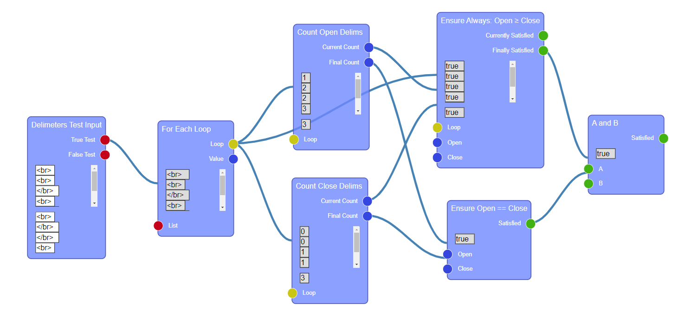

# Purpose-based Programming (PBP) Environment

This is a prototype development environment for "purpose-first" programming, in which students construct the solution to a program out of problem-specific **plan blocks** that have inherent meaning (e.g. count the number of open delimeters in a list of tokens). It represents programs with a functional, data-flow interface (below), but models traditional imperative programming, with control structures like loops and conditionals.

## Project setup

* Before setup, make sure to install [Node.js and NPM](https://nodejs.org/en/download/).
* Clone this repository anywhere on your system.
* Run `npm install`. This will install all dependencies.

## Running and Deploying

* To compile and hot-reload during development, use `npm run serve`.
  * Afterwards, navigate to [http://localhost:8080/]() to see the project.
  * Use Ctrl+C / Cmd+C to stop the server.
* To compile and minify for production, use `npm run build`.
  * Afterwards, the created files can be deployed on any webserver (e.g. apache).
* To lints and fix files, use `npm run lint`.

### Customize configuration

This project is rendered using Vue.js (see below), and uses the vue-cli npm package to run. To update the configuration, see [Configuration Reference](https://cli.vuejs.org/config/).

## References / APIs

**Vue.js**: This project is rendered using [Vue.js](https://vuejs.org/), a state-based javascript front-end library for creating and managing user interfaces. Vue is similar to other state-based renderers (e.g. React or Flutter), but works differently than traditional front-end web APIs (e.g. jQuery), so if you're not familiar with the paradigm, it's helpful to read documentation/tutorials. Everything the user sees and interacts with is rendered using Vue.js.

**Rete.js**: The data-flow programming library this project uses is [Rete.js](https://rete.js.org/). Rete.js handles the definition of programming blocks (i.e. plan blocks), how they connect, how computation occurs and how inputs/outputs of those blocks are rendered. Rete.js uses Vue.js to render these components.

## Project Structure

* `node_modules/`: This folder is automatically created and maintained by npm. It holds dependencies.
* `public/`: This holds the static HTML/CSS and assets that will be included in the project.
* `src/`: Compiled javascript source.
  * `assets/`: Static assets used by Vue.js.
  * `components/`: Vue.js components that make up the UI, e.g. to represent the input/output of the plan blocks.
  * `controls/`: [Rete.js controls](https://rete.js.org/#/docs/controls) that represent the UI parts of a Rete.js component (i.e. plan block).
    * `controls.js`: See above.
    * `objects.js`: Represents control-flow objects (e.g. a loop), which are acted upon by components.
  * `rete-components/`: [Rete.js components](https://rete.js.org/#/docs/components) (not to be confused with Vue.js components), which represent definitions for each plan block.
    * `*-comp`: Plan blocks for a specific problem.
    * `sockets.js`: Defines [Rete.js sockets](https://rete.js.org/#/docs/sockets) that control how and whether components can connect.
  * `App.vue`: The root-level component for Vue rendering.
  * `eventBus.js`: Allows for communication across Vue.js components. See [here](https://v3.vuejs.org/guide/migration/events-api.html) for more.
  * `main.js`: The entrypoint for javascript code execution and dependencies.
* `babel.config.js`: Configuration for [Babel.js](https://babeljs.io/), which compiles javascript and helps with cross-platform support.